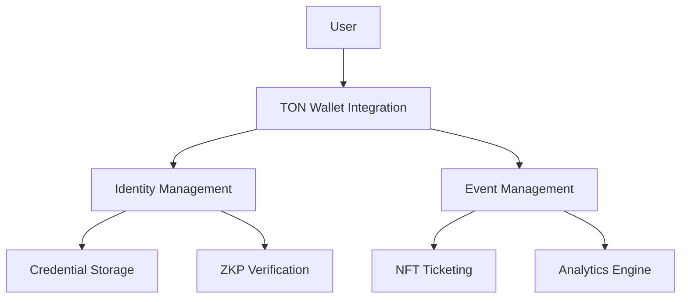

# ✨ Spark

> Empowering Digital Nomads with Decentralized Identity Verification on TON Blockchain

[](https://opensource.org/licenses/MIT)
[](https://ton.org)
[](https://twitter.com/sparkidentity)

## 🌟 What is Spark?

Spark is a revolutionary decentralized identity platform built on the TON blockchain, designed specifically for digital nomads. It enables secure, private, and verifiable digital identity management while seamlessly integrating with event management and community features.

## 🚀 Key Features

### Core Identity Management
- 🔐 **Decentralized Identity (DID) Profiles**
  - Create and manage blockchain-based identity profiles
  - Full ownership and control of personal data
  - Immutable verification history

- 📜 **Verifiable Credentials**
  - Issue and store trusted credentials
  - Employment history verification
  - Residency proof management
  - Educational certificates

- 🎭 **Privacy-First Design**
  - Zero-knowledge proof verification
  - Selective credential sharing
  - Encrypted data storage

### Event & Community Features
- 🎫 **Decentralized Event Management**
  - Create and manage blockchain-based events
  - NFT ticketing system
  - Attendance verification
  - Real-time analytics

- 🏆 **Rewards & Recognition**
  - NFT-based attendance certificates
  - Community achievement badges
  - Points-based loyalty program
  - Exclusive member benefits

## 💡 Why Spark?

### For Digital Nomads
- 🌍 Manage your digital identity across borders
- 🔒 Own and control your personal data
- ✅ Easily verify credentials to service providers
- 🤝 Connect with a global community

### For Event Organizers
- 📊 Access detailed analytics and insights
- 🎯 Target verified audience segments
- 💫 Create engaging community experiences
- 💰 Reduce operational costs

## 🛠 Technical Architecture



## 🌈 Getting Started

### Prerequisites
- TON Wallet
- Node.js v16+
- yarn/npm

### Installation
```bash
# Clone the repository
git clone https://github.com/jcmsj/did

# Install dependencies
cd did
pnpm install

# Start development server
pnpm dev
```

## 📱 Mobile Experience

Spark is built with a mobile-first approach, ensuring seamless experience across devices:
- Progressive Web App (PWA) support
- Native-like interactions
- Offline capability
- Push notifications

## 🌍 Multilingual Support

Currently supported languages:
- English
- Spanish
- Mandarin
- Russian
- Japanese

## 🤝 Contributing

We welcome contributions! Please see our [Contributing Guide](CONTRIBUTING.md) for details.

### Development Setup
1. Fork the repository
2. Create your feature branch
3. Commit your changes
4. Push to the branch
5. Create a Pull Request

## 📄 License

This project is licensed under the MIT License - see the [LICENSE](LICENSE) file for details.

## 🔮 Roadmap

### Q2 2024
- [ ] Launch beta version
- [ ] Implement core DID features
- [ ] Release mobile apps

### Q3 2024
- [ ] Add cross-chain support
- [ ] Expand verification network
- [ ] Launch loyalty program

### Q4 2024
- [ ] Global marketing campaign
- [ ] Enterprise partnerships
- [ ] Advanced analytics release

## 📞 Support

- Documentation: [docs.sparkidentity.com](https://docs.sparkidentity.tadashijei.com)
- Email: support@sparkidentity.tadashijei.com

---

<p align="center">Made with ❤️ by the Spark team</p>
