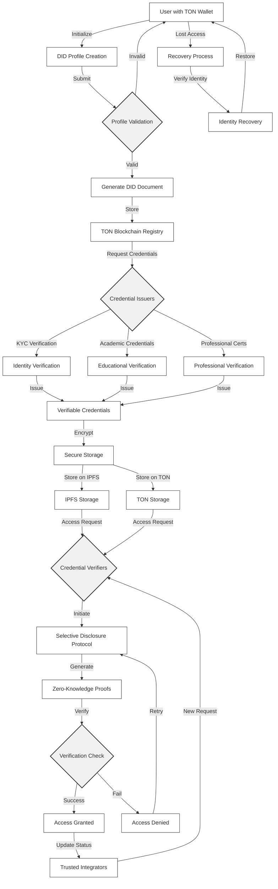

# Decentralized Identity Verification for Digital Nomads

This project aims to provide digital nomads and remote workers with a decentralized identity solution, allowing them to securely manage verifiable credentials for residency, taxation, employment history, and more. Using the TON (The Open Network) blockchain, the solution emphasizes user privacy, data security, and decentralization.

## Overview

As the gig economy and remote work grow, digital nomads face unique challenges in managing credentials and verifying identity in different jurisdictions. This project aims to address these challenges by providing a decentralized solution where users can create, store, and share verifiable credentials. This empowers digital nomads to control their identity information while facilitating trust with employers, landlords, government entities, and other stakeholders.

## Project Objectives

1. **Decentralized Identity (DID) Profiles**: Enable users to create DID profiles on the TON blockchain, capturing key identity attributes for verification.
2. **Verifiable Credentials (VCs)**: Provide support for issuing, storing, and sharing VCs, such as proof of residency and employment history, verified by trusted entities.
3. **Selective Credential Sharing**: Allow users to selectively share credentials with third parties without exposing unnecessary personal information.
4. **Privacy and Data Security**: Ensure privacy-preserving credential verification through zero-knowledge proofs (ZKPs).
5. **Integration with TON Wallet**: Enable seamless access and management of credentials through users' TON wallets.

## Key Features

- **DID Profile Creation**: Each user creates a decentralized identity on the TON blockchain, representing their verified digital identity.
- **Verifiable Credential Issuance and Management**: Trusted entities issue and verify credentials that are stored on-chain and managed by users.
- **Selective Disclosure**: Users can selectively disclose certain credentials while maintaining control over their private information.
- **Zero-Knowledge Proofs**: Use ZKPs to allow users to verify attributes without exposing full data, ensuring privacy in transactions.
- **TON Wallet Integration**: Credentials can be managed via the TON wallet, allowing for easy access, sharing, and management within the same ecosystem.

## Technical Architecture



## Stakeholders

- **Primary Users**: Digital nomads, remote workers, freelancers, and expatriates.
- **Credential Issuers**: Entities like employers, tax authorities, and local government bodies.
- **Credential Verifiers**: Prospective employers, rental agencies, government officials, and online platforms.
- **TON Community**: Developers, maintainers, and contributors supporting the platform.
- **Third-Party Integrators**: Companies interested in integrating decentralized identity verification.

## Roadmap

### Phase 1: MVP Development (Q1 2024)
- Implement DID profiles, credential issuance, and storage.
- Begin onboarding users and testing core functionalities.

### Phase 2: Wallet Integration & Privacy Features (Q2 2024)
- Integrate TON wallet for seamless credential management.
- Implement ZKPs for secure, privacy-focused credential sharing.

### Phase 3: Partnerships with Credential Issuers & Verifiers (Q3 2024)
- Partner with freelance platforms, remote work agencies, and government entities.
- Roll out API access for verifiers.

### Phase 4: Full Launch (Q4 2024)
- Expand user base, foster ecosystem growth, and enhance features based on feedback.

## Success Metrics

- **User Adoption**: Track the number of digital nomads using the platform.
- **Credential Volume**: Monitor the number of credentials issued and verified.
- **Verification Speed**: Measure the time taken for successful credential verification.
- **Privacy Compliance**: Ensure no unauthorized data disclosures.

## Risks and Mitigations

- **Privacy Risks**: Use ZKPs and selective disclosure to protect user data.
- **Data Loss**: Offer recovery options like multi-signature and trusted contacts.
- **Adoption Risks**: Launch promotional programs to attract credential issuers and verifiers.

## Technology Stack

- **Blockchain**: TON for DID registration, credential issuance, and verification.
- **Storage**: IPFS for secure, decentralized data storage.
- **Zero-Knowledge Proofs**: For secure, privacy-preserving verifications.
- **Frontend**: Web3-based UI with mobile support.
- **Wallet Integration**: TON wallet for credential management.

## Getting Started

### Prerequisites
- TON wallet installation
- Basic understanding of Web3 and blockchain technology

### Installation

1. **Clone the repository**
    ```bash
    git clone https://github.com/TadashiJei/Decentralized-Identity-Verification-for-Digital-Nomads
    cd identity-verification
    ```

2. **Install dependencies**
    ```bash
    npm install
    ```

3. **Start the application**
    ```bash
    npm start
    ```

## Contributing

Contributions are welcome! Please open a pull request or submit issues for discussion.

## License

MIT License. See `LICENSE` for more information.
